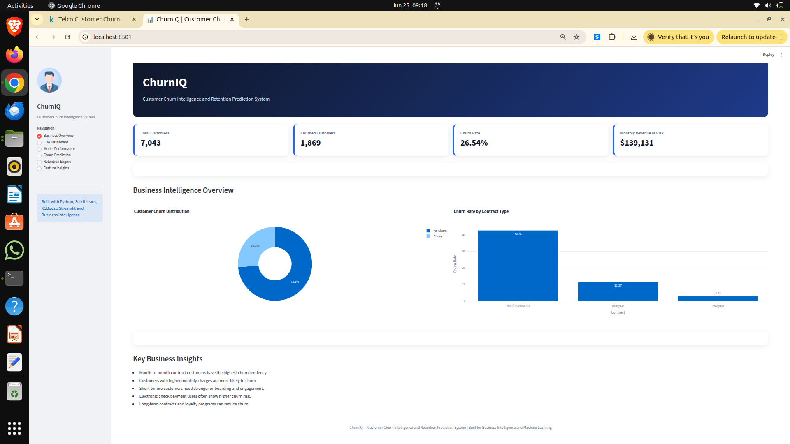
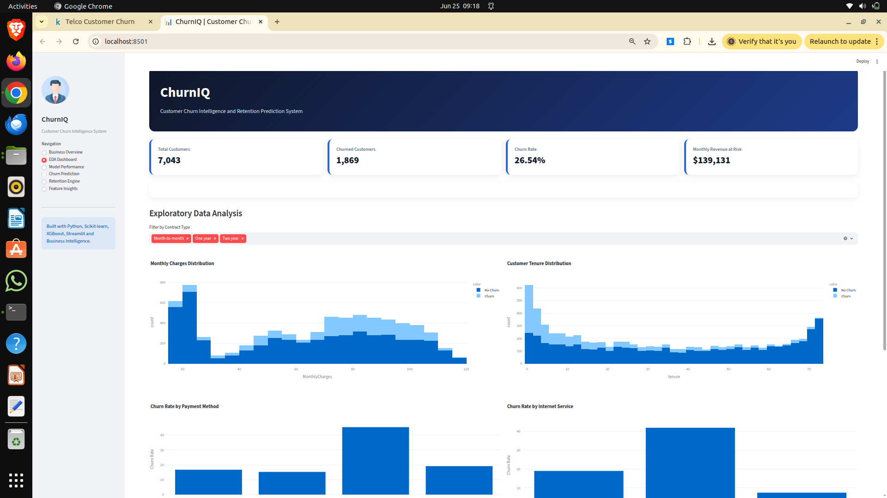
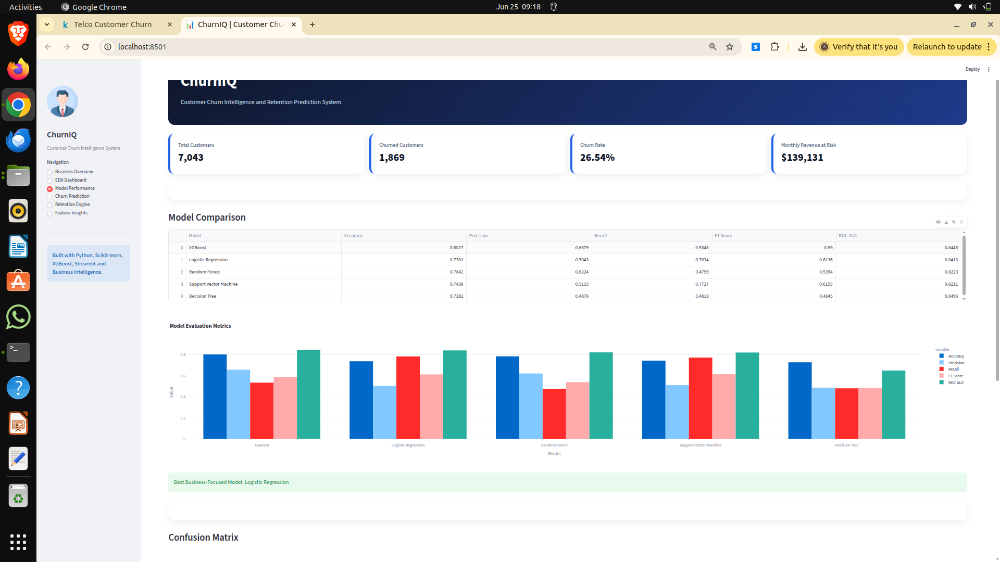
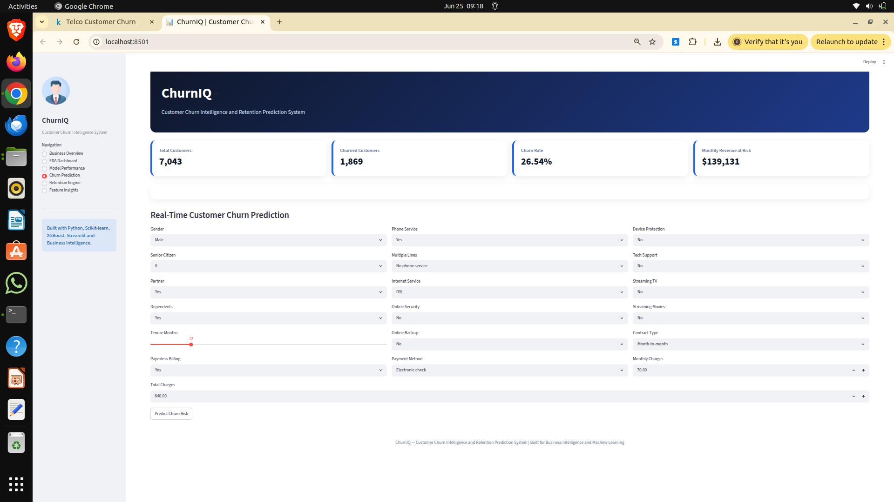
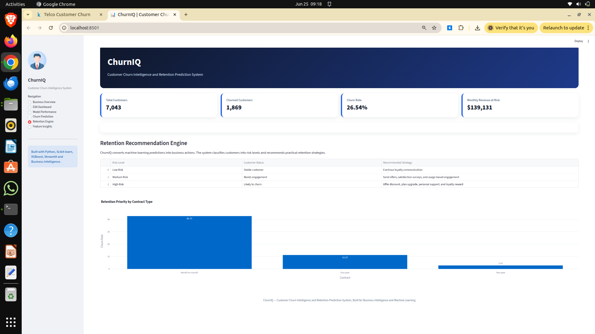
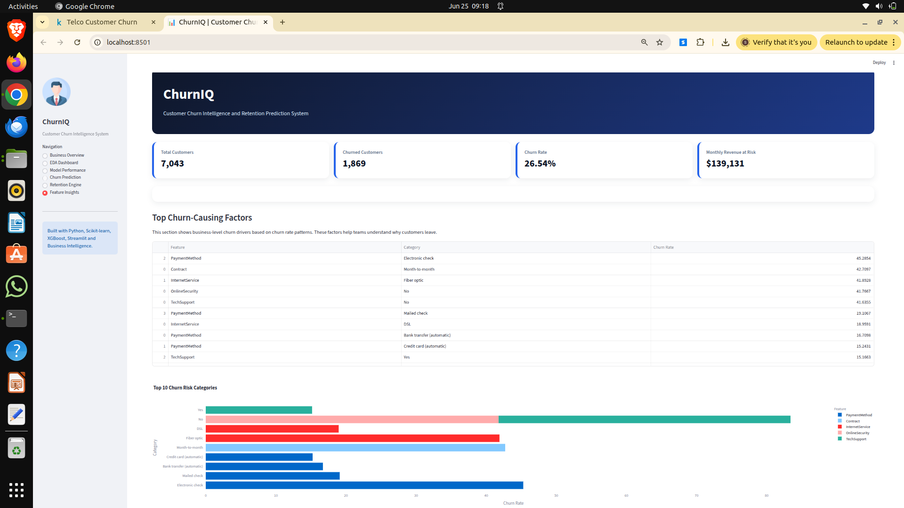
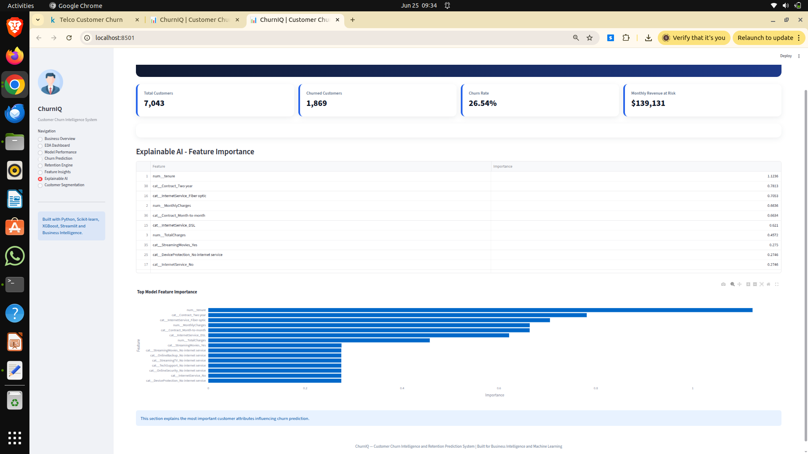

# ChurnIQ — Customer Churn Intelligence and Retention Prediction System


---

## ChurnIQ

**Customer Churn Intelligence and Retention Prediction System**

An end-to-end machine learning system designed to predict customer churn, identify high-risk customers, generate actionable retention strategies, perform customer segmentation, and provide explainable AI insights.

Built for business intelligence, predictive analytics, and customer retention optimization.

---

## Project Highlights

- End-to-end ML pipeline
- Business-focused best model selection
- Real-time churn prediction
- Explainable AI feature importance
- Customer segmentation using KMeans
- Retention recommendation engine
- Revenue-at-risk estimation
- Downloadable business reports
- Professional Streamlit dashboard

---

## Business Problem

Customer churn directly impacts revenue and long-term growth.

ChurnIQ helps businesses:

- Detect potential churners early
- Understand why customers leave
- Reduce revenue loss
- Improve retention strategy
- Build customer loyalty

---

## Target Industries

- Telecom
- SaaS
- Subscription Businesses
- Banking
- Insurance
- E-commerce

---

## Tech Stack

### Languages & Libraries

- Python
- Pandas
- NumPy
- Scikit-learn
- XGBoost
- Streamlit
- Plotly
- Joblib
- Matplotlib
- Seaborn
- SHAP

---

## Machine Learning Models Used

| Model | Purpose |
|---|---|
| Logistic Regression | Baseline + Interpretability |
| Decision Tree | Rule-based learning |
| Random Forest | Ensemble learning |
| XGBoost | Gradient boosting |
| Support Vector Machine | High-dimensional classification |

---

## Core Features

### Data Processing

- Missing value handling
- Duplicate removal
- Feature encoding
- Data scaling
- Outlier detection

---

### Exploratory Data Analysis

- Churn distribution analysis
- Monthly charges analysis
- Customer tenure analysis
- Contract analysis
- Payment method analysis
- Service usage analysis
- Correlation heatmap

---

### Model Comparison

Evaluation based on:

- Accuracy
- Precision
- Recall
- F1 Score
- ROC-AUC Score
- Confusion Matrix
- Classification Report

---

### Real-Time Churn Prediction

Predict customer churn based on:

- Tenure
- Monthly charges
- Contract type
- Payment method
- Internet service
- Total charges
- Senior citizen
- Dependents

Outputs:

- Churn probability
- Risk level
- Retention recommendation

---

### Explainable AI

Includes:

- Feature importance visualization
- Top churn-causing factors
- Model interpretability

---

### Customer Segmentation

Segments customers into:

- High Value Loyal
- Premium At Risk
- Moderate Value
- New / Low Value

Used for personalized retention planning.

---

### Retention Engine

Generates business strategies like:

- Loyalty rewards
- Discounts
- Plan optimization
- Personalized support
- Engagement campaigns

---

### Revenue Loss Estimation

Calculates:

- Potential monthly revenue at risk
- High-risk customer value exposure

---

## Project Structure

```text
ChurnIQ/
│── app.py
│── train.py
│── model.py
│── utils.py
│── shap_analysis.py
│── customer_segmentation.py
│── requirements.txt
│── README.md
│── .gitignore
│
├── dataset/
│   └── README.md
│
├── models/
├── reports/
├── screenshots/
├── notebooks/
```

---

## Workflow

```text
Dataset
↓
Data Cleaning
↓
EDA
↓
Feature Engineering
↓
Model Training
↓
Model Evaluation
↓
Best Model Selection
↓
Explainability
↓
Customer Segmentation
↓
Retention Engine
↓
Deployment
```

---

## Model Performance

### Best Selected Model: Logistic Regression

| Metric | Score |
|---|---|
| Accuracy | 73.81% |
| Precision | 50.43% |
| Recall | 78.34% |
| F1 Score | 61.36% |
| ROC-AUC | 84.12% |

---

## Why Logistic Regression?

Although XGBoost achieved higher accuracy, Logistic Regression was selected because:

- Higher recall
- Better churn detection
- Lower false negatives
- Better business usability
- Easier explainability

Business priority = Catch churners early.

---

## Screenshots

### Business Overview



---

### EDA Dashboard



---

### Model Performance



---

### Churn Prediction



---

### Retention Engine



---

### Feature Insights



---

### Explainable AI



---

## Dataset

Dataset used:

IBM Telco Customer Churn Dataset

Features:

- Customer tenure
- Monthly charges
- Total charges
- Contract type
- Payment method
- Internet services
- Technical support
- Online security
- Dependents

Target:

- Churn (Yes / No)

---

## Installation

Clone repo:

```bash
git clone https://github.com/build-with-saurav/ChurnIQ.git
cd ChurnIQ
```

Create environment:

```bash
python3 -m venv churniq_env
source churniq_env/bin/activate
```

Install dependencies:

```bash
pip install -r requirements.txt
```

Train model:

```bash
python train.py
```

Run dashboard:

```bash
streamlit run app.py
```

---

## Business Insights

Key findings:

- Month-to-month contracts churn most
- High monthly charges increase churn risk
- New customers are vulnerable
- Electronic check users churn more
- Long-term contracts improve retention

---

## Future Improvements

- SHAP local explanation
- Churn forecasting
- Revenue forecasting
- CLV prediction
- Email retention automation
- Deep learning models
- Cloud deployment
- API integration

---

## Deployment

Deploy using Streamlit Community Cloud.

Add live demo here:

```text
https://your-streamlit-app-url
```

---

## GitHub Topics

```text
machine-learning
customer-churn-prediction
business-intelligence
predictive-analytics
streamlit
xgboost
classification
customer-retention
explainable-ai
shap
customer-segmentation
data-science
```

---

## Author

**Saurav Kumar Singh**

B.Tech CSE — NIT Calicut

AI | ML | Data Science | Predictive Analytics

---
